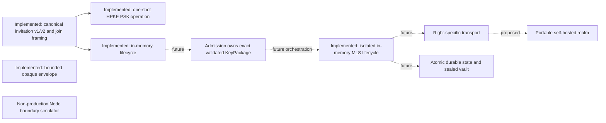

# Session Chat 2.0 independent-audit brief

Status: architecture and protocol-laboratory review package

This brief is the entry point for an independent review of Session Chat 2.0.
It deliberately separates code-backed evidence from accepted design contracts,
research proposals, and deferred work. It is suitable for an architecture and
protocol review now. It is not a request to certify a production application,
because no production client, integrated MLS product path, durable store,
network service, or deployable realm exists.

An auditor should record the exact Git commit, parent or comparison base,
`Cargo.lock` digest, enabled Cargo features, and tool versions used for the
review. Git history is the authoritative snapshot; this living document does
not embed a revision that would become stale on its next edit.

## Claim states

Every claim in this package has one of these states:

| State | Meaning |
| --- | --- |
| **Implemented and tested** | Present in retained code with deterministic evidence. |
| **Accepted contract, unimplemented** | Required by an accepted ADR or normative design contract, but absent from runtime code. |
| **Proposed experiment** | Research-backed recommendation that still needs a spike and decision record. |
| **Deferred** | Deliberately outside the current phase. |
| **Out of scope** | Not promised, including resistance to a compromised unlocked endpoint or a participant copying plaintext. |

Document-level headings such as “proposed architecture” do not override these
per-claim states. “Opaque” means content-agnostic framing, not encryption.
Method names such as `reserve_after_admission` and `consume_after_membership`
state caller preconditions; the current crate does not verify admission or
perform MLS membership changes.

## Current system in one page

The checked-in runtime consists of:

- `session-protocol`: bounded canonical opaque-envelope framing, signed
  secret-capability invitation v1/v2 descriptors, protected outer/inner join
  request framing, exact outer AAD, and a deposit-only local endpoint value;
- `session-core`: an inviter-owned, in-memory invitation registry with
  issue/expiry, reservation, release, and consumption transitions;
- `session-crypto-hpke`: a provider-neutral one-shot RFC 9180 PSK join adapter
  with a pinned AWS-LC implementation, typed contexts, and coarse errors;
- `session-crypto-mls`: an isolated, in-memory two-party MLS 1.0 adapter with
  bounded KeyPackage/Welcome/message inputs, exact KeyPackage ownership,
  Add/Welcome, application messages, path updates, removal, and explicit
  prepare/apply stages; and
- a disposable Node.js sealed-post-office simulator used only to test boundary
  semantics such as schema rejection, right-specific authorization ordering,
  rotation, and capacity limits.

There is no replay-aware capability admission state machine, admission-to-MLS
orchestration, mailbox runtime, durable transaction, production transport,
client vault, desktop shell, hosted realm, or headless end-to-end client. The
HPKE adapter proves PSK possession only for its exact typed context. The
isolated MLS adapter uses exact `mls-rs` 0.56.0 and AWS-LC 0.25.0 dependencies,
but exposes no durable or network path. The superseded OpenMLS selection remains
blocked by repository dependency policy. The Node simulator's custom
composition of platform crypto and placeholder address control is explicitly
non-production.

ADR 0014 and `docs/specs/PROTECTED_CAPABILITY_JOIN_V1.md` accept an exact local
HPKE capability-join and one-Welcome response contract. The canonical values
and isolated HPKE proof operation are runtime inventory; replay policy,
admission, mailbox, and state transitions remain accepted-but-unimplemented
contracts.



## Claims and evidence ledger

| Property | State | Evidence or condition |
| --- | --- | --- |
| Opaque envelope has a versioned canonical encoding and an input-size bound | Implemented and tested | `session-protocol` fixtures and malformed/oversized negative tests |
| Opaque envelope bytes are encrypted | Accepted contract, unimplemented | Current fixture can contain literal plaintext bytes; future HPKE/MLS producers must establish confidentiality |
| Secret-capability invitation is canonical, strictly Ed25519-verified, time-bounded, and signed over all accepted fields | Implemented and tested | ADRs 0005/0007, signed-invitation fixtures and negative tests |
| Invitation v2 and protected outer/inner/AAD/deposit-endpoint layouts are canonical and bounded | Implemented and tested | ADR 0014 protocol fixtures, closed-code-point tests, malformed/non-preferred/trailing rejection, and exact size-boundary tests |
| Invitation reservation is tied to the exact record instance, including expiry/reissue with reused invitation and request IDs | Implemented and tested | `InvitationReservation.record_signature` and stale release/consume regression tests |
| Invitation state is durable or rollback resistant | Accepted contract, unimplemented | ADR 0008 and the roadmap require a later cross-layer transaction |
| Isolated MLS validation owns the exact KeyPackage, credential identity, leaf key, and reference through Add/Welcome | Implemented and tested | Private non-`Clone` adapter value and retained lifecycle tests; this is not admission |
| Admission owns that exact validated MLS value after proof and approval | Accepted contract, unimplemented | ADR 0009; no admission crate or proof verifier exists |
| Capability possession is HPKE-protected and bound to the exact local join context | Implemented and tested | Typed one-shot AWS-LC adapter, official RFC PSK vector, independent-provider opening, wrong-key/context and tampering rejection; this is not replay-aware admission |
| Two-party MLS Add/Welcome, application messages, path updates, removal, replay/reordering, and delayed-Commit handling work in memory | Implemented and tested | `session-crypto-mls` lifecycle and hostile-member tests with exact pinned provider graph |
| Product-level forward secrecy, post-compromise security, durable removal isolation, and interoperability | Accepted contract, unimplemented | Requires cross-implementation fixtures, durable state, deletion/rollback evidence, and independent boundary review |
| Welcome delivery is idempotent and atomic with MLS, replay, approval, and invitation state | Accepted contract, unimplemented | Architecture transaction invariant; no durable store exists |
| Deposit, receive, acknowledge, and rotate rights are non-interchangeable | Accepted contract, unimplemented | ADR 0010; ADR 0014 additionally defines one exact local response profile; Node simulator evidence does not establish a production transport |
| The Node simulator rejects unknown, cyclic, accessor-backed, symbol-keyed, deep, or oversized provider input before cloning or authorization | Implemented and tested | Retained non-production adversarial tests at directory and attestor entry points |
| Client secrets are sealed when not in an active user-approved session | Proposed experiment | Session-scoped vault proposal with whole-store fallback; no dependency selected |
| A realm can be replaced without giving its operator content or membership authority | Proposed experiment | Compose and signed-realm-descriptor proposal; no service exists |
| GitHub and credential admission, recovery, multi-device, mixnets, and federation | Deferred | Later roadmap phases |

## Intended architecture and authority boundaries

Session security, admission, rendezvous, and transport are independent layers.
No layer inherits authority merely because it carries another layer's bytes.

- MLS membership, not transport delivery, authorizes participation in a group.
- Admission proves authorization for one exact proposed member key; it neither
  adds that member nor grants mailbox rights.
- Invitation possession permits only the versioned invitation flow and never
  implies a stable external identity.
- Directory or address-attestor signatures bind routing material but do not
  grant receive, acknowledgement, rotation, admission, or MLS authority.
- Deposit, receive, acknowledgement, and rotation capabilities are distinct.
- A realm operator may control availability and observe profile-specific
  metadata. It must not receive client plaintext or MLS group secrets.
- Private transport must fail closed instead of silently using a faster,
  less-private path.

The future join path is conditional on one ownership chain:

1. Bound and parse an untrusted canonical join request.
2. Verify its proof over the invitation, challenge, verifier audience, exact
   KeyPackage, credential identity, leaf key, expiration, and replay context.
3. Return a linear `VerifiedAdmission` that owns the parsed KeyPackage.
4. Obtain explicit inviter approval and reserve the invitation instance.
5. Use that same owned object for MLS Add/Commit; no caller may substitute bytes
   or a separately supplied digest.
6. Atomically persist MLS state, replay state, approval/result, invitation
   consumption, and an encrypted idempotent Welcome outbox item.
7. Release the reservation on pre-commit failure; after commit, resume delivery
   without replaying membership.

Only two crash-recovery outcomes are acceptable: uncommitted and safely
releasable, or committed and consumed with resumable Welcome delivery.

## Data and trust-boundary inventory

| Component | Allowed input/state | Must never receive or retain |
| --- | --- | --- |
| UI/webview | Redacted display models, explicit user decisions | Vault roots, database keys, MLS secrets, raw provider tokens, unrestricted mailbox capabilities |
| Session core | Validated protocol objects and narrowly owned capabilities | Unbounded or side-effecting decoded input |
| Isolated MLS adapter | Session credential/key material, exact validated KeyPackage, in-memory group state | Stable external identity as an MLS identity claim; admission and durable state remain external |
| Future admission adapter | Minimum evidence needed for the invitation policy | Reusable provider tokens after verification, unrelated identity fields |
| Directory | Public or recipient-authorized routing bundle and freshness data | Conversation plaintext, MLS secrets, receive or membership authority |
| Sealed mailbox | Bounded opaque items and one exact right per operation | Plaintext, group keys, interchangeable rights, stable sender identity by default |
| Fast/private transport | Opaque encrypted envelopes and profile-required routing metadata | Admission authority or an implicit profile downgrade |
| Realm operator | Service policy, public descriptor, role-scoped service keys, operational metadata | Client vault keys, MLS group keys, plaintext, offline root in online services |
| Logs/telemetry/crash reports | Bounded redacted operational events | Invitations, capabilities, tokens, plaintext, keys, raw protocol objects |
| Backups | Versioned encrypted state required by an explicit recovery policy | Decrypted client state or a path that silently restores stale MLS state |
| Build/update system | Source, lockfiles, immutable action references, signed release inputs | Long-lived credentials in logs or untrusted pull-request execution |

## Cryptographic inventory

Implemented dependencies are pinned in `Cargo.toml` and `Cargo.lock`:

- `ed25519-dalek` 3.0.0 with strict verification for invitation signatures;
- `minicbor` 2.3.0 for the restricted deterministic CBOR profile; and
- `zeroize` 1.9.0 for best-effort clearing of owned secret buffers.

The isolated MLS adapter pins `mls-rs` 0.56.0 and
`mls-rs-crypto-awslc` 0.25.0 with a reduced feature set and the RFC 9420
mandatory-to-implement X25519/AES-128-GCM/SHA-256/Ed25519 ciphersuite. The
[comparison](research/MLS_IMPLEMENTATION_COMPARISON.md) records the dated
dependency screening and disposable ownership/storage-boundary experiment. Upstream
states that `mls-rs` has not received a full independent third-party audit, so
the selection is not inherited assurance for Session Chat. ADR 0011 and the
[OpenMLS applicability map](research/OPENMLS_0_8_1_APPLICABILITY.md) retain the
rejected OpenMLS graph and its published audit context.

The adapter uses upstream's BasicCredential provider only as an MLS credential
format. It generates each session-scoped identity through the selected AWS-LC
ciphersuite provider and exposes that identity read-only for exact admission
binding; this is not an authentication or admission claim. Because pinned
`mls-rs` 0.56.0 exposes no public KeyPackage leaf accessor, the adapter
re-decodes the already
provider-validated KeyPackage through a private mirror of that exact TLS layout
to enforce the closed leaf extension/capability policy. Review that maintenance
seam and its negative test on every provider update.

HPKE, encrypted storage, OS key protectors, realm signing, and signed updates
have not been selected. Citations in the reference ledger are research inputs,
not dependency decisions.

## Conditional target guarantees

These are release gates, not present-tense promises:

| Target claim | Required evidence before the claim is allowed |
| --- | --- |
| Content confidential from infrastructure | Interoperable MLS/HPKE vectors, negative tests, packet/storage inspection, and no server-held content keys |
| Only approved members participate | Exact KeyPackage admission ownership, explicit approval, MLS membership tests, replay rejection, and cross-layer transaction evidence |
| Removed members cannot read future messages | Deterministic removal/epoch tests plus persistence and reordered/lost-message tests |
| Compromise recovery | Key updates and epoch advancement tested against the stated MLS compromise model; endpoint compromise limitations remain explicit |
| Ephemeral local state | Retention policy, deletion/backup/swap/notification tests, and honest recipient-copy language |
| Locked client data is unusable | Per-platform vault conformance, sealed-operation matrix, memory/IPC/crash-dump checks, and rollback analysis |
| Private profile does not downgrade | Network-deny integration tests, dependency traffic inventory, packet captures, and explicit failure UX |
| Metadata-private or anonymous operation | Named observer and non-collusion assumptions, measured traffic, anonymity-set requirements, and abuse controls |
| Replaceable self-hosted realm | Digest-pinned deployment, scoped service keys, tested restore/migration, signed monotonic discovery, and explicit trust-reset behavior after root loss |
| Production-ready software | Independent implementation review, operated vulnerability response, signed reproducible updates, release provenance, platform tests, and all roadmap gates |

## Storage, rollback, deletion, and recovery questions

Encryption at rest does not prove freshness. The future persistence design must
test every write boundary involving MLS state, invitation consumption, replay
records, approval, and Welcome delivery. Copies, backups, database pages, swap,
notifications, and crash reports are within the deletion boundary.

The proposed vault permits only bounded opaque receipt and non-sensitive
settings while sealed. Decrypt, sign, admission, MLS mutation,
acknowledgement, and capability rotation require the relevant session to be
unsealed with user presence. A whole-device snapshot can still roll encrypted
state back; a monotonic anchor remains an open research question. Recovery and
multi-device synchronization are deferred because they can undermine deletion,
device continuity, and forward-secrecy assumptions.

## Hosting and disaster-recovery questions

The proposed first deployment is a one-host, digest-pinned Compose appliance
with automatic TLS, scoped secrets, durable storage, and tested restore. The
next design level separates stable realm identity from DNS and any one host with
an offline-root-signed, monotonic realm descriptor and online role keys. Active
session endpoint rotation remains member-authenticated and right-specific.

Host loss may cause availability loss. A planned migration may preserve a
pinned realm only through a newer valid descriptor. Loss of the offline root
requires an explicit new-realm trust decision; DNS or TLS alone must not
silently re-establish continuity. None of this is implemented today.

## Recommended audit stages

1. **Now — architecture and protocol contracts:** assess layer separation,
   authority, invitation state, canonical formats, threat completeness, and
   feasibility of the accepted future invariants.
2. **Now and after durable state — MLS implementation review:** assess the
   current crypto provider boundary, exact KeyPackage ownership,
   Add/Commit/Welcome, update/removal, and storage-call evidence; then reassess
   crash injection, rollback, atomic outbox behavior, and deletion once built.
3. **After the first client and hosted vertical slice — endpoint/network review:**
   assess the vault, IPC/UI privilege boundary, updates, platform artifacts,
   packet captures, deployment, operations, and disaster recovery.

High-value questions for the current review include:

- Can the selected `mls-rs`/AWS-LC adapter participate in the required single
  application transaction without split-brain membership or Welcome state?
- Is the proposed linear ownership API sufficient to prevent KeyPackage,
  credential, or leaf-key substitution at every seam?
- Which monotonic anchor can reject stale device or database snapshots without
  creating a new availability or tracking oracle?
- Can any directory, realm root, redirect, or transport component acquire a
  right it did not already possess?
- Are the clock, expiry, replay, reservation, and restore rules fail closed?
- Are the proposed observer and non-collusion assumptions strong enough for
  each Fast, Private, or future Anonymous label?
- Can build dependencies or signed updates bypass all endpoint guarantees?

## Near-term research and implementation sequence

The canonical invitation-v2 and protected-request parser increment from ADR
0014 now preserves invitation-v1 bytes, rejects malformed and unknown
representations before provider or state work, and retains exact fixtures. The
provider-neutral HPKE operation now has RFC 9180 and cross-provider evidence.
The following admission increment must
consume the exact validated KeyPackage value already proven by the isolated MLS
adapter; it may not accept a replacement byte string or digest at the Add seam.
Keep integration in memory until the cross-layer durable transaction and
Welcome outbox design has crash/rollback evidence.

The next evidence-producing research or implementation tasks are:

1. Design and retain the linear capability-admission ownership and
   before-mutation rejection matrix.
2. Complete the `mls-rs` group-state/KeyPackage repository call trace and cross-layer
   crash/rollback model.
3. Parser fuzzing and invitation/admission state-machine property-test plan.
4. RNG and clock-source contracts for expiry, replay, and deterministic tests.

Then implement, in order: the canonical capability proof and linear admission
contract; right-specific adverse
in-memory transport; the headless in-memory flow; and
only then durable persistence and a networked/client vertical slice.

GitHub/credential admission, OHTTP, Privacy Pass, desktop-framework selection,
mixnets, recovery, and federation should not interrupt the capability-only
in-memory Phase 1 path.

## Reproduction and evidence index

Run from a clean checkout of the exact revision under review:

```sh
cargo fetch --locked
cargo fmt --all --check
cargo clippy --workspace --all-targets --all-features --locked --offline -- -D warnings
cargo test --workspace --all-features --locked --offline
RUSTDOCFLAGS="-D warnings" cargo doc --workspace --all-features --no-deps --locked --offline
cargo deny --all-features --locked check
node --test scripts/check-repository.test.mjs scripts/setup-codex-links.test.mjs
node --test spikes/sealed-invitation-provider/test/provider.test.mjs
node scripts/check-repository.mjs
git diff --check
```

Relevant source documents:

- [`PRODUCT_V2.md`](PRODUCT_V2.md): conditional product outcomes and non-goals
- [`ARCHITECTURE_V2.md`](ARCHITECTURE_V2.md): components, dependency direction,
  join transaction, and current implementation boundary
- [`IDENTITY_AND_ADMISSION.md`](IDENTITY_AND_ADMISSION.md): evidence and exact
  member-key binding
- [`TRANSPORTS.md`](TRANSPORTS.md): profiles, rights, metadata, and no-downgrade
- [`THREAT_MODEL.md`](THREAT_MODEL.md): assets, adversaries, mitigations, and
  residual risk
- [`ROADMAP_V2.md`](ROADMAP_V2.md): phase gates and exclusions
- [`RESEARCH_BACKLOG.md`](RESEARCH_BACKLOG.md): unresolved decisions
- [`REFERENCES.md`](REFERENCES.md): standards and primary research inputs
- [`adr/`](adr/): accepted decisions and their scope
- [`specs/SIGNED_INVITATION_V1.md`](specs/SIGNED_INVITATION_V1.md): implemented
  invitation wire and caller-precondition limits
- [`spikes/SEALED_INVITATION_PROVIDER_PROTOCOL.md`](spikes/SEALED_INVITATION_PROVIDER_PROTOCOL.md): non-production first-contact contract
- [`spikes/client-vault-portable-hosting/hardening.md`](spikes/client-vault-portable-hosting/hardening.md): proposed vault and realm options

CI demonstrates only the commands and policies it actually runs. Repository
settings such as required checks, branch protection, secret scanning, and
private vulnerability reporting require separate GitHub configuration evidence.
