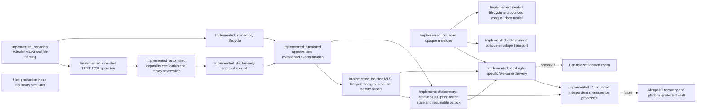

# Session Chat 2.0 independent-audit brief

Status: architecture and protocol-laboratory review package

This brief is the entry point for an independent review of Session Chat 2.0.
It deliberately separates code-backed evidence from accepted design contracts,
research proposals, and deferred work. It is suitable for an architecture and
protocol review now. It is not a request to certify a production application,
because no independently restartable production client, production durable
store, network service, or deployable realm exists. The publish-disabled
conformance runner demonstrates only a bounded, graceful process close/reopen
laboratory flow.

An auditor should record the exact Git commit, parent or comparison base,
`Cargo.lock` digest, enabled Cargo features, and tool versions used for the
review. Git history is the authoritative snapshot; this living document does
not embed a revision that would become stale on its next edit.

## Claim states

Every claim in this package has one of these states:

| State | Meaning |
| --- | --- |
| **Implemented and tested** | Present in retained code with deterministic evidence. |
| **Accepted contract, unimplemented** | Required by an accepted ADR or normative design contract, but absent from runtime code. |
| **Proposed experiment** | Research-backed recommendation that still needs a spike and decision record. |
| **Deferred** | Deliberately outside the current phase. |
| **Out of scope** | Not promised, including resistance to a compromised unlocked endpoint or a participant copying plaintext. |

Document-level headings such as “proposed architecture” do not override these
per-claim states. “Opaque” means content-agnostic framing, not encryption.
Method names such as `reserve_after_admission` and `consume_after_membership`
state caller preconditions; the current crate does not verify admission or
perform MLS membership changes.

## Current system in one page

The checked-in runtime consists of:

- `session-protocol`: bounded canonical opaque-envelope framing, signed
  secret-capability invitation v1/v2 descriptors, protected outer/inner join
  request framing, exact outer AAD, and a deposit-only local endpoint value;
- `session-core`: an inviter-owned, in-memory invitation v1/v2 registry with
  issue/expiry, reservation, release, and consumption transitions; local v2
  issuance accepts only the provider-generated complete invitation wrapper;
- `session-crypto-hpke`: a provider-neutral one-shot RFC 9180 PSK join adapter
  with a pinned AWS-LC implementation, typed contexts, and coarse errors;
- `session-admission`: a provider-neutral, display-only approval context and
  decision contract with no proof, bearer, reservation, or membership authority;
- `admission-capability`: an in-memory capability verifier and simulated
  approval coordinator that retains exact HPKE-opened invitation provenance,
  owns the exact provider KeyPackage, reserves request-ID/nonce and local v2
  state, implements the shared observation seam, and permits only its original
  approved one-shot value to enter MLS;
- `session-crypto-mls`: an isolated two-party MLS 1.0 adapter with bounded
  KeyPackage/Welcome/message inputs, exact KeyPackage ownership, Add/Welcome,
  application messages, path updates, removal, explicit prepare/apply stages,
  configurable group/KeyPackage stores, and a load-only durable identity
  boundary. Its secret-bearing identity value is opaque and non-cloneable/
  non-debuggable, and durable clients are bound to one exact group;
- `session-transport`: a bounded, single-process local one-Welcome mailbox with
  provider-generated, separate deposit, receive, and acknowledgement authority,
  exact-retry idempotency, expiry, coarse errors, a narrow provider-neutral
  right-specific opaque-envelope trait, and an additive generalized static
  dispatch boundary with bounded requests, explicit deadline/wall-clock/
  cancellation observations, and positional right wrappers;
- `transport-memory`: a bounded deterministic test adapter for explicit drop,
  duplicate, hold/release reordering, retry, and acknowledgement behavior that
  also adopts the generalized cursorless boundary with exact canonical bytes,
  final-observation expiry checks, fixed live-state ceilings, and exact-set
  idempotent acknowledgement; its additive test-only controls model bounded
  outage, corrupt polling, exact-byte stale replay, and acknowledgement-result
  loss with a secret-free snapshot;
- `transport-conformance`: a publish-disabled offline test-support crate whose
  current increments strictly parse and canonically re-encode bounded,
  alias-only adverse trace v1 fixtures and run one normalized trace twice
  against fresh memory adapters with exact-byte and quiescence checks; its
  reusable adapter verdict suite is not complete;
- `session-storage`: a deterministic in-memory sealed-session lifecycle and
  bounded canonical opaque-inbox conformance model with generation-bound local
  import plus bounded external unlock preparation, one-shot credentials, and
  stale-result rejection, but no encrypted or durable persistence;
- `key-protector-passphrase`: an exact-session non-production wrapped-key
  protector using the fixed ADR 0019 construction through the ADR 0020 unlock
  boundary, but no SQLCipher or desktop credential path;
- `storage-sqlcipher`: an encrypted file-backed laboratory adapter exercising
  the real inviter and joiner MLS storage calls, one group-bound client identity,
  atomic inviter reservation/MLS/Welcome-outbox persistence, and restartable
  outbox leasing on the required Linux, macOS, and Windows CI runners;
- `sessionctl`: a headless two-client composition covering protected capability
  join, simulated approval, an atomic SQLCipher inviter commit, ambiguous-result
  recovery, real close/reopen with exact Alice identity/group reload, resumed
  local Welcome delivery, bidirectional MLS messages, path update, removal, and
  post-removal rejection; ADR 0021 additionally runs Alice, Bob, and an
  untrusted forwarder as independent processes over bounded local IPC, exits
  Alice after commit, reloads her exact state in a fresh process, and emits a
  redacted manifest; and
- a disposable Node.js sealed-post-office simulator used only to test boundary
  semantics such as schema rejection, right-specific authorization ordering,
  rotation, and capacity limits.

There is no human approval UX, abrupt-kill/power-loss recovery, independently
restartable durable product, network or production transport, production
client vault, desktop shell, or hosted realm. The
HPKE adapter proves PSK possession only for its exact typed context; the
capability adapter performs automated verification, explicit simulated
approval, exact v2/replay reservation, and MLS coordination. The isolated MLS
adapter uses exact `mls-rs` 0.56.0 and AWS-LC 0.25.0 dependencies. The headless
path uses its storage and group-bound identity-reload boundaries through
SQLCipher. The L1 process runner crosses graceful Alice exit, but hands its
disposable raw database key through an Alice-only test file rather than a
platform vault and retains approval/replay shadows only in the initialization
process. The superseded OpenMLS selection remains
blocked by repository dependency policy. The Node simulator's custom
composition of platform crypto and placeholder address control is explicitly
non-production.

ADR 0014 and `docs/specs/PROTECTED_CAPABILITY_JOIN_V1.md` accept an exact local
HPKE capability-join and one-Welcome response contract. The canonical values
and isolated HPKE proof operation are runtime inventory, as is bounded
single-process replay-aware capability verification and approval-gated
invitation/MLS sequencing. The right-specific local mailbox is also runtime
inventory, and the committed approved-join result carries only its authenticated
deposit endpoint beside the exact MLS outputs. A retained test deposits the
encrypted Welcome. Human approval UX, durable replay loading, platform key
custody, durable approval/replay reload, and abrupt-kill cross-process recovery
remain accepted-but-unimplemented contracts.



## Claims and evidence ledger

| Property | State | Evidence or condition |
| --- | --- | --- |
| Opaque envelope has a versioned canonical encoding and an input-size bound | Implemented and tested | `session-protocol` fixtures and malformed/oversized negative tests |
| Opaque envelope bytes are encrypted | Accepted contract, unimplemented | Current fixture can contain literal plaintext bytes; future HPKE/MLS producers must establish confidentiality |
| Secret-capability invitation is canonical, strictly Ed25519-verified, time-bounded, and signed over all accepted fields | Implemented and tested | ADRs 0005/0007, signed-invitation fixtures and negative tests |
| Invitation v2 and protected outer/inner/AAD/deposit-endpoint layouts are canonical and bounded | Implemented and tested | ADR 0014 protocol fixtures, closed-code-point tests, malformed/non-preferred/trailing rejection, and exact size-boundary tests |
| Invitation v1/v2 reservation is tied to the schema and exact record instance, including expiry/reissue with reused invitation and request IDs | Implemented and tested | Shared bounded registry, provider-only local v2 issuance, `InvitationReservation.record_signature`, and stale release/consume regression tests |
| One inviter reservation/consumption shadow is atomically composed with MLS and Welcome-outbox persistence | Implemented and tested in the in-process SQLCipher laboratory | `sessionctl` and `storage-sqlcipher` cover rollback, ambiguous commit recovery, exact reload, and delivery resumption; full invitation/replay state reload and rollback resistance remain unimplemented |
| Isolated MLS validation owns the exact KeyPackage, credential identity, leaf key, and reference through Add/Welcome | Implemented and tested | Private non-`Clone` adapter value and retained lifecycle tests; this is not admission |
| Automated capability verification owns the exact validated MLS value after HPKE proof | Implemented and tested | Private non-cloneable proof/provider object retains exact invitation signature; exact tuple and verifier-owned reservation checks reject substitution and foreign authority |
| Pending approval has a provider-neutral observation and decision seam | Implemented and tested | ADR 0015 and `session-admission` expose only redacted, non-authorizing context; the capability provider retains exact proof, KeyPackage, and reservations |
| Explicit approval gates exact v2 invitation, replay, and MLS Add sequencing | Implemented and tested in memory | One-shot simulated `Approve`/`Reject`; direct verified-to-MLS API removed; rejection, expiry, failed prepare, and abandonment release both reservations; success consumes invitation after Add |
| Approval, invitation state, replay state, MLS Add, and Welcome outbox are independently recoverable as one durable product transaction | Accepted contract, unimplemented | The in-process headless slice atomically persists inviter reservation/MLS/outbox state and reconciles its in-memory approval/replay shadows after ambiguous commit; it cannot reload those shadows in a fresh process |
| Capability possession is HPKE-protected and bound to the exact local join context | Implemented and tested | Typed one-shot AWS-LC adapter, official RFC PSK vector, independent-provider opening, wrong-key/context and tampering rejection |
| Request ID and nonce are replay-reserved within one invitation generation | Implemented and tested | Bounded in-memory reservations cover same-generation replay, expiry/reissue independence, stale-release ABA, and capacity preservation; not durable or rollback resistant |
| Two-party MLS Add/Welcome, application messages, path updates, removal, replay/reordering, and delayed-Commit handling work | Implemented and tested | `session-crypto-mls` lifecycle and hostile-member tests with the exact pinned provider graph; the SQLCipher slice additionally reloads one exact group/member after close/reopen |
| Durable MLS identity storage is secret-safe and bound to one exact group | Implemented and tested | The 141-byte v1 record crosses the public trait only in an opaque non-`Clone`, non-`Debug`/non-`Display` type; SQL-loaded record bytes enter zeroizing ownership before validation; schema v4 stores an exact group binding, and create/load/join reject cross-group use while the frozen RFC 8032 fixture and a semantically valid schema-v3 identity/group reload preserve compatibility |
| Product-level forward secrecy, post-compromise security, durable removal isolation, and interoperability | Accepted contract, unimplemented | Requires cross-implementation fixtures, durable state, deletion/rollback evidence, and independent boundary review |
| Approved in-memory join returns the exact deposit endpoint beside the encrypted MLS Welcome | Implemented and tested | The endpoint moves from the HPKE-authenticated request through approval and MLS apply; expiry is checked before reservation and MLS mutation, while local delivery and non-rollback after delivery failure are retained integration evidence |
| Inviter reservation, MLS state, and Welcome outbox creation are atomic and delivery resumes after close/reopen | Implemented and tested in-process and across graceful Alice process exit | The real capability path recovers an ambiguous commit, reloads the exact identity/group, leases the committed Welcome, and delivers it once. ADR 0021 repeats the positive reload in a fresh Alice process; durable approval/replay reload, abrupt kill, and power-loss recovery remain unimplemented |
| Local deposit, receive, and acknowledge rights are non-interchangeable | Implemented and tested | `session-transport` uses separately typed provider-generated authorities, commitment checks, hostile authority tests, and an approved-join integration test |
| Generalized dispatch keeps already-issued right wrappers out of other operation positions | Implemented and tested as a positional contract | `EnvelopeDelivery` compile-fail tests include aliased inner associated types, delivery IDs, and cursors. Wrappers alone do not prevent cross-right derivation; every provider must validate exact scope and document duplication policy per right. Deposit endpoints may support controlled transfer, while receive and acknowledgement authority should be non-cloneable by default. The memory provider supplies three private non-`Clone` types with domain-separated commitments. |
| Generalized operations separate monotonic deadlines, fallible wall time, and cooperative cancellation | Implemented and tested as a local dispatch contract | Pre-entry rejection, post-provider checkpoints, and clock-failure tests are joined by a standard-library blocking supervisor that accepts legal delayed wakeups, wakes on external cancellation/deadline, and drops pending work. It is a cross-platform headless/worker-thread baseline, not provider preemption or a future UI-runtime selection. |
| Ambiguous committed deposits can be reconciled without a second logical delivery | Implemented and tested in memory and SQLCipher | The sole-owner ledger persists attempts and leases. Both the deterministic model and file-backed adapter retry the exact canonical envelope/endpoint after ambiguous acceptance and preserve one membership commit across reopen. |
| Deterministic memory delivery models loss, duplication, reordering, replay, retry, expiry, and bounded capacity | Implemented and tested | `transport-memory` fault-plan and hostile-authority tests over `OpaqueEnvelope`; generalized tests preserve exact canonical bytes, reject changed-byte retries and every cursor, enforce count/byte/live-state ceilings, normalize unknown/repeated exact-set acknowledgement, and revalidate expiry at the final checkpoint. This is neither encryption nor a network/privacy claim. |
| Test-only memory controls model outage, corrupt polling, stale replay, and lost acknowledgement results | Implemented and tested in memory | One-shot/persistent controls are bounded, unavailable deposit preserves the next fault, corrupt poll does not dequeue, stale replay requires the exact retained digest without restoring acknowledged state, and acknowledgement loss distinguishes before- from after-commit through secret-free counts. No remote or coordinator claim follows. |
| Adverse trace v1 is canonical, versioned, bounded, and secret-free | Reusable runner and verdict slice implemented and tested | `transport-conformance` rejects unknown/noncanonical/oversized input, duplicate/forward aliases, excessive lines/steps/checkpoints, unreachable pending expectations, and seeded diagnostics. Executable fixtures drive the retained adverse vocabulary twice through fresh LocalV1 memory adapters; output is alias-only, exact bindings and canonical bytes are enforced, delayed wake/drop and quiescence are bounded, and deliberately defective bridges prove failure detection. Network, durability, and provider-wide conformance remain unimplemented. |
| One headless two-client flow composes protected join through removal | Implemented and tested in-process and across graceful process exit | `sessionctl` explicitly approves the exact capability request, atomically commits inviter/MLS/outbox state, closes/reopens, reloads the group-bound Alice identity and group, resumes Welcome delivery, then exchanges traffic, updates, removes Bob, and observes post-removal rejection. ADR 0021 separates Alice, Bob, and an untrusted forwarder, bounds and canonically validates seven IPC frames, reaps every child, and emits a redacted manifest; no abrupt-kill, power-loss, platform-vault, network, hosting, or UX claim |
| Reusable or network mailbox rotation is a separate non-interchangeable right | Accepted contract, unimplemented | ADR 0010; the one-use local profile deliberately has no rotation operation, and Node simulator evidence does not establish production transport |
| The Node simulator rejects unknown, cyclic, accessor-backed, symbol-keyed, deep, or oversized provider input before cloning or authorization | Implemented and tested | Retained non-production adversarial tests at directory and attestor entry points |
| A sealed-session lifecycle and locked-mode capability matrix reject stale completion and gate privileged model operations | Implemented and tested in memory | ADRs 0016/0020 and `session-storage`; exact vault-instance/session/generation result binding, pre-provider cancellation checks, one-shot credentials, and bounded work are retained without a durable or production-scheduler claim |
| Sealed mode accepts only bounded canonical opaque receipt, and local import requires the exact open and insertion generations | Implemented and tested in memory | `session-storage` malformed, expiry, quota, all-state append, and vault/inbox ABA tests; local removal is not remote acknowledgement |
| Inviter MLS/join/Welcome state and joiner MLS/KeyPackage deletion are each one owner-local encrypted file transaction | Implemented and tested on three CI OS families | ADR 0017 and `storage-sqlcipher` use the real MLS storage path with rollback, ambiguous-result, exact-retry, wrong-key, and close/reopen evidence; hosted runners do not establish production packaging or broader platform support |
| Key protector claims are factually capability-gated | Implemented and tested as a contract | `session-storage` rejects a protector weaker than `TestOnly`, `DeviceBound`, or `FreshUserPresence`; no native adapter exists |
| The portable wrapped-key protector can drive the deterministic lifecycle without retaining a passphrase | Implemented and tested as non-production conformance | `key-protector-passphrase` owns only the wrapped record, consumes one exact-session credential, reports `ApplicationWrapped`/`MayBackup`, and remains disconnected from SQLCipher |
| Local-app foundations require one common macOS, Windows, and Linux baseline | Accepted contract; CI gate implemented | ADR 0018 and the required Rust matrix; no desktop shell or portable production key protector exists yet |
| Client secrets are protected by a production platform vault when not active | Accepted contract, unimplemented | SQLCipher accepts an external raw key, but no native protector supplies it and no rollback anchor exists |
| A realm can be replaced without giving its operator content or membership authority | Proposed experiment | Compose and signed-realm-descriptor proposal; no service exists |
| GitHub and credential admission, recovery, multi-device, mixnets, and federation | Deferred | Later roadmap phases |

## Intended architecture and authority boundaries

Session security, admission, rendezvous, and transport are independent layers.
No layer inherits authority merely because it carries another layer's bytes.

- MLS membership, not transport delivery, authorizes participation in a group.
- Admission proves authorization for one exact proposed member key; it neither
  adds that member nor grants mailbox rights.
- Invitation possession permits only the versioned invitation flow and never
  implies a stable external identity.
- Directory or address-attestor signatures bind routing material but do not
  grant receive, acknowledgement, rotation, admission, or MLS authority.
- Deposit, receive, acknowledgement, and rotation capabilities are distinct.
- A realm operator may control availability and observe profile-specific
  metadata. It must not receive client plaintext or MLS group secrets.
- Private transport must fail closed instead of silently using a faster,
  less-private path.

The future join path is conditional on one ownership chain:

1. Bound and parse an untrusted canonical join request.
2. Verify its proof over the invitation, challenge, verifier audience, exact
   KeyPackage, credential identity, leaf key, expiration, and replay context.
3. Return a linear `VerifiedAdmission` that owns the parsed KeyPackage.
4. Obtain explicit inviter approval and reserve the invitation instance.
5. Use that same owned object for MLS Add/Commit; no caller may substitute bytes
   or a separately supplied digest.
6. Atomically persist MLS state, replay state, approval/result, invitation
   consumption, and an encrypted idempotent Welcome outbox item.
7. Release the reservation on pre-commit failure; after commit, resume delivery
   without replaying membership.

Only two crash-recovery outcomes are acceptable: uncommitted and safely
releasable, or committed and consumed with resumable Welcome delivery.

## Data and trust-boundary inventory

| Component | Allowed input/state | Must never receive or retain |
| --- | --- | --- |
| UI/webview | Redacted display models, explicit user decisions | Vault roots, database keys, MLS secrets, raw provider tokens, unrestricted mailbox capabilities |
| Session core | Validated protocol objects and narrowly owned capabilities | Unbounded or side-effecting decoded input |
| Isolated MLS adapter | Session-scoped credential/key material, exact validated KeyPackage, provider-owned group/KeyPackage state, and one opaque group-bound durable identity record | Stable external identity as an MLS identity claim; admission authority, raw secret diagnostics, or cross-group signer reuse |
| Future admission adapter | Minimum evidence needed for the invitation policy | Reusable provider tokens after verification, unrelated identity fields |
| Directory | Public or recipient-authorized routing bundle and freshness data | Conversation plaintext, MLS secrets, receive or membership authority |
| Sealed mailbox | Bounded opaque items and one exact right per operation | Plaintext, group keys, interchangeable rights, stable sender identity by default |
| Fast/private transport | Opaque encrypted envelopes and profile-required routing metadata | Admission authority or an implicit profile downgrade |
| Realm operator | Service policy, public descriptor, role-scoped service keys, operational metadata | Client vault keys, MLS group keys, plaintext, offline root in online services |
| Logs/telemetry/crash reports | Bounded redacted operational events | Invitations, capabilities, tokens, plaintext, keys, raw protocol objects |
| Backups | Versioned encrypted state required by an explicit recovery policy | Decrypted client state or a path that silently restores stale MLS state |
| Build/update system | Source, lockfiles, immutable action references, signed release inputs | Long-lived credentials in logs or untrusted pull-request execution |

## Cryptographic inventory

Implemented dependencies are pinned in `Cargo.toml` and `Cargo.lock`:

- `ed25519-dalek` 3.0.0 with strict verification for invitation signatures;
- `minicbor` 2.3.0 for the restricted deterministic CBOR profile; and
- `zeroize` 1.9.0 for best-effort clearing of owned secret buffers.

The isolated MLS adapter pins `mls-rs` 0.56.0 and
`mls-rs-crypto-awslc` 0.25.0 with a reduced feature set and the RFC 9420
mandatory-to-implement X25519/AES-128-GCM/SHA-256/Ed25519 ciphersuite. The
[comparison](research/MLS_IMPLEMENTATION_COMPARISON.md) records the dated
dependency screening and disposable ownership/storage-boundary experiment. Upstream
states that `mls-rs` has not received a full independent third-party audit, so
the selection is not inherited assurance for Session Chat. ADR 0011 and the
[OpenMLS applicability map](research/OPENMLS_0_8_1_APPLICABILITY.md) retain the
rejected OpenMLS graph and its published audit context.

The adapter uses upstream's BasicCredential provider only as an MLS credential
format. It generates each session-scoped identity through the selected AWS-LC
ciphersuite provider and exposes that identity read-only for exact admission
binding; this is not an authentication or admission claim. Because pinned
`mls-rs` 0.56.0 exposes no public KeyPackage leaf accessor, the adapter
re-decodes the already
provider-validated KeyPackage through a private mirror of that exact TLS layout
to enforce the closed leaf extension/capability policy. Review that maintenance
seam and its negative test on every provider update.

HPKE, encrypted storage, OS key protectors, realm signing, and signed updates
have not been selected. Citations in the reference ledger are research inputs,
not dependency decisions.

## Conditional target guarantees

These are release gates, not present-tense promises:

| Target claim | Required evidence before the claim is allowed |
| --- | --- |
| Content confidential from infrastructure | Interoperable MLS/HPKE vectors, negative tests, packet/storage inspection, and no server-held content keys |
| Only approved members participate | Exact KeyPackage admission ownership, explicit approval, MLS membership tests, replay rejection, and cross-layer transaction evidence |
| Removed members cannot read future messages | Deterministic removal/epoch tests plus persistence and reordered/lost-message tests |
| Compromise recovery | Key updates and epoch advancement tested against the stated MLS compromise model; endpoint compromise limitations remain explicit |
| Ephemeral local state | Retention policy, deletion/backup/swap/notification tests, and honest recipient-copy language |
| Locked client data is unusable | Per-platform vault conformance, sealed-operation matrix, memory/IPC/crash-dump checks, and rollback analysis |
| Private profile does not downgrade | Network-deny integration tests, dependency traffic inventory, packet captures, and explicit failure UX |
| Metadata-private or anonymous operation | Named observer and non-collusion assumptions, measured traffic, anonymity-set requirements, and abuse controls |
| Replaceable self-hosted realm | Digest-pinned deployment, scoped service keys, tested restore/migration, signed monotonic discovery, and explicit trust-reset behavior after root loss |
| Production-ready software | Independent implementation review, operated vulnerability response, signed reproducible updates, release provenance, platform tests, and all roadmap gates |

## Storage, rollback, deletion, and recovery questions

Encryption at rest does not prove freshness. The future persistence design must
test every write boundary involving MLS state, invitation consumption, replay
records, approval, and Welcome delivery. Copies, backups, database pages, swap,
notifications, and crash reports are within the deletion boundary.

The proposed vault permits only bounded opaque receipt and non-sensitive
settings while sealed. Decrypt, sign, admission, MLS mutation,
acknowledgement, and capability rotation require the relevant session to be
unsealed with user presence. A whole-device snapshot can still roll encrypted
state back; a monotonic anchor remains an open research question. Recovery and
multi-device synchronization are deferred because they can undermine deletion,
device continuity, and forward-secrecy assumptions.

## Hosting and disaster-recovery questions

The proposed first deployment is a one-host, digest-pinned Compose appliance
with automatic TLS, scoped secrets, durable storage, and tested restore. The
next design level separates stable realm identity from DNS and any one host with
an offline-root-signed, monotonic realm descriptor and online role keys. Active
session endpoint rotation remains member-authenticated and right-specific.

Host loss may cause availability loss. A planned migration may preserve a
pinned realm only through a newer valid descriptor. Loss of the offline root
requires an explicit new-realm trust decision; DNS or TLS alone must not
silently re-establish continuity. None of this is implemented today.

## Recommended audit stages

1. **Now — architecture and protocol contracts:** assess layer separation,
   authority, invitation state, canonical formats, threat completeness, and
   feasibility of the accepted future invariants.
2. **Now and after abrupt-kill recovery — MLS/storage review:** assess
   the current crypto provider boundary, exact KeyPackage ownership,
   Add/Commit/Welcome, update/removal, group-bound identity record, SQLCipher
   atomicity, close/reopen recovery, outbox behavior, and explicit non-claims;
   then reassess abrupt power loss, rollback anchoring, and old-secret deletion.
3. **After the first client and hosted vertical slice — endpoint/network review:**
   assess the vault, IPC/UI privilege boundary, updates, platform artifacts,
   packet captures, deployment, operations, and disaster recovery.

High-value questions for the current review include:

- Does the retained `mls-rs`/AWS-LC/SQLCipher composition actually prevent
  split-brain membership, Welcome state, secret logging, and cross-group signer
  reuse across every public storage and reload seam?
- Is the proposed linear ownership API sufficient to prevent KeyPackage,
  credential, or leaf-key substitution at every seam?
- Which monotonic anchor can reject stale device or database snapshots without
  creating a new availability or tracking oracle?
- Can any directory, realm root, redirect, or transport component acquire a
  right it did not already possess?
- Are the clock, expiry, replay, reservation, and restore rules fail closed?
- Are the proposed observer and non-collusion assumptions strong enough for
  each Fast, Private, or future Anonymous label?
- Can build dependencies or signed updates bypass all endpoint guarantees?

## Near-term research and implementation sequence

The canonical invitation-v2 and protected-request parser increment from ADR
0014 now preserves invitation-v1 bytes, rejects malformed and unknown
representations before provider or state work, and retains exact fixtures. The
provider-neutral HPKE operation now has RFC 9180 and cross-provider evidence.
The admission increment owns the exact validated KeyPackage value, retains the
exact HPKE-opened invitation signature, binds it to local v2 state, consumes an
explicit simulated approval decision, and permits only that one-shot value to
enter Add preparation. It does not accept a replacement byte string or digest.
The headless composition crosses a real SQLCipher transaction: it resolves
rollback or ambiguous commit, reloads the exact group-bound client identity and
group after close/reopen, and resumes Welcome delivery from the sole-owner
outbox. ADR 0021 repeats the positive lifecycle across graceful Alice process
exit, Bob, and an untrusted forwarder. The approval/replay shadows are still
process memory, and the raw database key uses a disposable Alice-only test file
rather than a platform vault.

The next evidence-producing research or implementation tasks are:

1. Add hostile independent-process cases plus abrupt-kill, disk-full, and
   power-loss evidence without weakening the exact identity/group and outbox
   recovery contract.
2. Make approval/result, replay, and invitation state reloadable with the MLS
   and Welcome-outbox transaction, including rollback-anchor research.
3. Select a common platform key-custody baseline before connecting SQLCipher to
   a desktop credential path.
4. Retain parser fuzzing, state-machine properties, and explicit RNG/clock
   contracts at every newly durable or network-facing boundary.

Only after those gates should the laboratory be promoted into a networked or
desktop-client vertical slice.

GitHub/credential admission, OHTTP, Privacy Pass, desktop-framework selection,
mixnets, user recovery, and federation should not interrupt completion of the
capability-only durable-client foundation.

## Reproduction and evidence index

Run from a clean checkout of the exact revision under review:

```sh
cargo fetch --locked
cargo fmt --all --check
cargo clippy --workspace --all-targets --all-features --locked --offline -- -D warnings
cargo test --workspace --all-features --locked --offline
RUSTDOCFLAGS="-D warnings" cargo doc --workspace --all-features --no-deps --locked --offline
cargo deny --all-features --locked check
node --test scripts/check-repository.test.mjs scripts/setup-codex-links.test.mjs
node --test spikes/sealed-invitation-provider/test/provider.test.mjs
node scripts/check-repository.mjs
git diff --check
```

Relevant source documents:

- [`PRODUCT_V2.md`](PRODUCT_V2.md): conditional product outcomes and non-goals
- [`ARCHITECTURE_V2.md`](ARCHITECTURE_V2.md): components, dependency direction,
  join transaction, and current implementation boundary
- [`IDENTITY_AND_ADMISSION.md`](IDENTITY_AND_ADMISSION.md): evidence and exact
  member-key binding
- [`TRANSPORTS.md`](TRANSPORTS.md): profiles, rights, metadata, and no-downgrade
- [`THREAT_MODEL.md`](THREAT_MODEL.md): assets, adversaries, mitigations, and
  residual risk
- [`ROADMAP_V2.md`](ROADMAP_V2.md): phase gates and exclusions
- [`RESEARCH_BACKLOG.md`](RESEARCH_BACKLOG.md): unresolved decisions
- [`REFERENCES.md`](REFERENCES.md): standards and primary research inputs
- [`adr/`](adr/): accepted decisions and their scope
- [`specs/SIGNED_INVITATION_V1.md`](specs/SIGNED_INVITATION_V1.md): implemented
  invitation wire and caller-precondition limits
- [`spikes/SEALED_INVITATION_PROVIDER_PROTOCOL.md`](spikes/SEALED_INVITATION_PROVIDER_PROTOCOL.md): non-production first-contact contract
- [`spikes/client-vault-portable-hosting/hardening.md`](spikes/client-vault-portable-hosting/hardening.md): proposed vault and realm options

CI demonstrates only the commands and policies it actually runs. Repository
settings such as required checks, branch protection, secret scanning, and
private vulnerability reporting require separate GitHub configuration evidence.
