# Session Chat Re-Architecture Epic

## Epic Summary

Re-architect Session Chat from a client-trusting websocket prototype into a server-authoritative ephemeral chat platform where:

- a host creates a room through the backend
- invites are opaque, random, server-issued secrets
- invite redemption creates a membership record
- websocket access is authenticated at connection time
- room lifecycle is explicit and enforceable
- the host can end the room and force teardown
- transient state expires automatically

## Why This Epic Exists

The current implementation has structural security gaps:

- the client generates and validates invite material
- the server trusts client-supplied identity hints such as `referrer`, `uid`, and `room`
- sockets are joined to rooms before strong authorization is established
- session teardown is not implemented as a first-class flow
- room and invite state lack TTL and revocation semantics

These are not isolated bugs. They come from the current trust model. The redesign corrects the trust model first.

## Product Goals

1. Allow a host to create a temporary private room.
2. Allow invited participants to join using a secret-bearing invite.
3. Support multiple users in a single live chat session.
4. Make the backend the source of truth for authorization.
5. End the room cleanly when the host ends it.
6. Leave as little persistent sensitive state behind as possible.

## Non-Goals For This Epic

- permanent user accounts
- social discovery features
- message history retention beyond the active session
- large-scale moderation tooling
- federation across independent server operators

## Architecture Principles

### 1. Server-authoritative trust

The client may present credentials, but it must not decide:

- who is authorized
- what constitutes a valid invite
- who owns a room
- whether a room is still active

### 2. Explicit lifecycle state

Rooms, invites, memberships, and websocket connections each need explicit states and transitions.

### 3. Least privilege tokens

Use purpose-specific tokens:

- invite token for join intent
- access token for active room participation
- optional admin token for host actions

Each token should be scoped, short-lived, and revocable where possible.

### 4. Thin websocket event surface

Websocket messages should carry chat intent, not authentication facts. Identity and room context should be attached server-side at handshake time.

### 5. Ephemeral by default

Prefer TTL-backed storage, explicit end-of-room teardown, and minimal long-term persistence.

## Current State vs Target State

| Area | Current State | Target State |
|---|---|---|
| Invite generation | Client-generated deterministic hash | Server-generated opaque random token |
| Invite validation | Client-side hash check plus weak backend link check | Backend-only validation and redemption |
| Participant identity | Client-supplied `uid` in login and messages | Backend-issued membership identity |
| Websocket auth | Per-message token in payload | Token verified during socket handshake |
| Room join | Client can attempt to join any room id | Room join only after valid invite redemption |
| Room end | Not implemented | Host-only end flow with disconnect and cleanup |
| State retention | Open-ended Redis keys | TTL-based ephemeral state |
| Testing | Mostly unit smoke tests | Lifecycle-focused integration and e2e coverage |

## Proposed Domain Model

### Room

Represents a single ephemeral chat session.

Suggested fields:

- `roomId`
- `hostMembershipId`
- `status` (`pending`, `active`, `ended`, `expired`)
- `createdAt`
- `activatedAt`
- `endedAt`
- `expiresAt`
- `metadata` (optional room config)

### Invite

Represents an invitation to join a room.

Suggested fields:

- `inviteId`
- `roomId`
- `tokenHash`
- `status` (`active`, `redeemed`, `expired`, `revoked`)
- `createdAt`
- `expiresAt`
- `redeemedAt`
- `redeemedByMembershipId`
- `maxUses`
- `useCount`
- `intendedDisplayName` (optional)

### Membership

Represents an authorized participant in a room.

Suggested fields:

- `membershipId`
- `roomId`
- `role` (`host`, `participant`)
- `displayName`
- `status` (`active`, `left`, `disconnected`, `revoked`)
- `joinedAt`
- `lastSeenAt`

### Connection Session

Represents a live websocket presence.

Suggested fields:

- `connectionId`
- `membershipId`
- `roomId`
- `connectedAt`
- `disconnectedAt`

## Proposed API Boundaries

Use HTTP for lifecycle operations and websocket for real-time room events.

### HTTP API

#### `POST /rooms`

Creates a room and returns:

- `roomId`
- host admin credential or host session credential
- room expiry metadata

#### `POST /rooms/:roomId/invites`

Host-only endpoint. Creates one or more invite tokens and returns invite URLs.

#### `POST /invites/redeem`

Redeems an invite token with a requested display name.

Returns:

- membership identity
- room access token
- room metadata needed by the client

#### `POST /rooms/:roomId/end`

Host-only endpoint. Marks the room ended and triggers teardown.

#### Optional `GET /rooms/:roomId`

Host-only or membership-scoped room status endpoint for reconnect flows.

### Websocket API

Authenticate once during handshake with a room access token.

Socket context should contain:

- `roomId`
- `membershipId`
- `role`
- `displayName`

Event examples:

- `chat:send`
- `chat:receive`
- `presence:joined`
- `presence:left`
- `room:ended`
- `system:error`

Do not include `uid`, `room`, or bearer token in each chat payload.

## Authentication and Authorization Design

### Invite Tokens

- generated from secure random bytes
- sent to users only as opaque secrets
- stored server-side only as hashes
- one-time or bounded-use by policy
- expire automatically

Invite URL example:

`/join?token=<opaque-secret>`

### Access Tokens

Returned only after successful invite redemption or host room creation.

Claims should include:

- `sub` or `membershipId`
- `roomId`
- `role`
- `exp`
- `jti`

Constraints:

- short TTL
- validated during websocket handshake
- rejected if the room is ended or membership is revoked

### Authorization Rules

- only the host can create invites
- only a valid active invite can create a participant membership
- only active memberships can connect to the room websocket
- only the host can end the room
- only active room members can send messages
- room end invalidates further chat activity

## State Management Strategy

Redis remains a good fit for ephemeral MVP state.

Suggested key patterns:

- `room:{roomId}`
- `room:{roomId}:members`
- `invite:{inviteHash}`
- `membership:{membershipId}`
- `room:{roomId}:presence`

TTL strategy:

- room TTL based on configured session duration
- invite TTL shorter than or equal to room TTL
- membership TTL refreshed on activity if reconnect support is needed
- cleanup workers or keyspace-driven cleanup for ended rooms

## Room Lifecycle

### Room States

1. `pending`
2. `active`
3. `ended`
4. `expired`

### Typical Flow

```mermaid
flowchart LR
    A["Host creates room"] --> B["Backend stores room"]
    B --> C["Host creates invite"]
    C --> D["Participant redeems invite"]
    D --> E["Backend creates membership"]
    E --> F["Participant connects via websocket"]
    F --> G["Active chat session"]
    G --> H["Host ends room"]
    H --> I["Backend revokes room access"]
    I --> J["Sockets disconnected and state cleaned up"]
```

### End Room Semantics

When the host ends a room, the backend must:

- mark the room as `ended`
- revoke or invalidate active room access tokens
- revoke active invites
- broadcast `room:ended`
- disconnect room sockets
- schedule or execute cleanup

## Suggested Module Layout

Backend modules:

- `rooms`
- `invites`
- `memberships`
- `auth`
- `chat`
- `presence`
- `cleanup`

Shared contracts:

- explicit DTOs for HTTP endpoints
- explicit websocket event contracts
- avoid using a single mixed contract file for both trust-sensitive auth and casual chat events

Frontend areas:

- room creation flow
- invite management flow
- invite redemption flow
- chat room view
- ended-room and error states

## Delivery Phases

### Phase 0: Architecture and Contracts

- define domain models
- define API contracts
- define token strategy
- define room lifecycle states

### Phase 1: Secure Room and Invite Flows

- backend room creation
- backend invite issuance
- backend invite redemption
- remove client-generated invite validation

### Phase 2: Authenticated Websocket Chat

- socket handshake auth
- room-scoped authorization middleware
- server-derived sender identity
- event contract cleanup

### Phase 3: End Room and Cleanup

- host-only end-room API/event
- room-ended broadcast
- forced disconnect
- TTL enforcement and cleanup jobs

### Phase 4: Hardening and Operability

- audit logging for security-sensitive transitions
- integration and e2e coverage
- rate limiting and abuse protection
- observability and health checks

## Risks and Tradeoffs

### Redis-only MVP

Pros:

- good fit for ephemeral state
- simple operationally
- natural TTL support

Cons:

- weaker analytics and auditability
- more care needed around revocation and restart behavior

Decision:

- acceptable for MVP if room/invite/membership lifecycle is modeled clearly

### JWT vs Opaque Access Tokens

JWT pros:

- easy stateless verification at socket handshake

JWT cons:

- revocation is harder unless room and membership state are checked server-side

Decision:

- JWT is acceptable if every socket auth path also checks current room and membership state in Redis

## Success Metrics

The epic is complete when:

- the client no longer generates security-critical invite material
- forged room entry attempts fail
- reused invites are rejected according to policy
- participants cannot impersonate other participants
- the host can end a room and remove all access
- room and invite state expire automatically
- lifecycle tests cover the main attack and failure paths

## Open Decisions

- whether invites should be strictly single-use or configurable
- whether reconnect should be supported after transient disconnect
- whether display names must be unique within a room
- whether host credentials should be a distinct admin token or a host membership token with role claims
