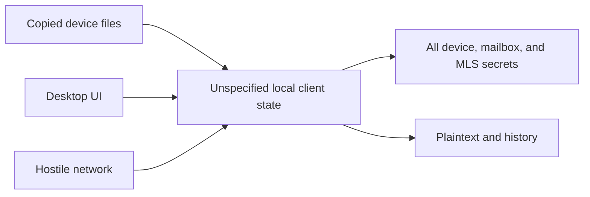
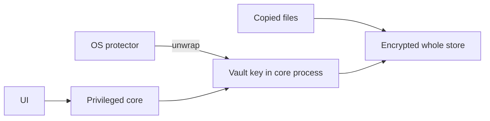
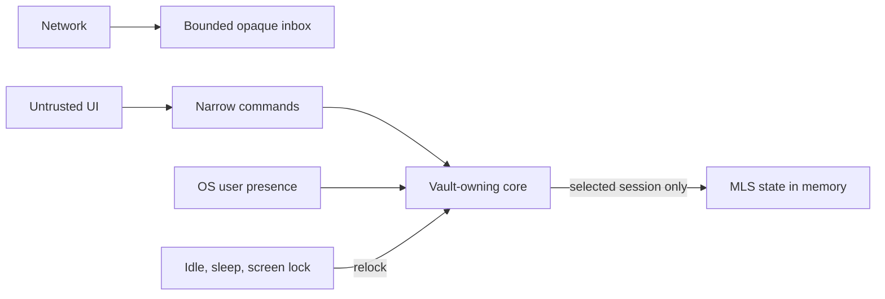
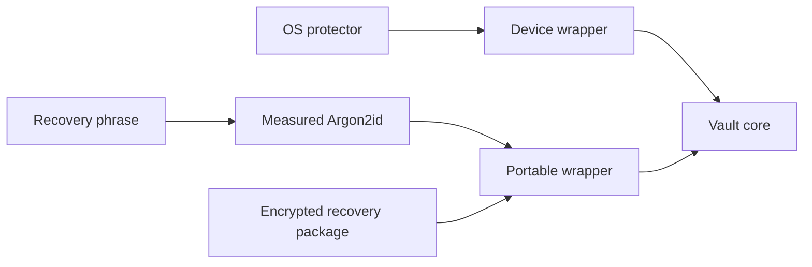

# Security Hardening Proposal: Seal client secret state outside active use

## Decision

Decide how the future desktop client keeps useful secret state unavailable while
the user is not actively using a session, without preventing bounded receipt of
opaque network envelopes. This proposal does not select a desktop shell,
encrypted database, or production cryptographic dependency.

## Executive Recommendation

We have three serious options. **Option 1, Whole-store device wrapping**, is the
smallest useful baseline. **Option 2, Session-scoped sealed vault**, adds a
separate opaque inbox, a narrow secret-owning core, and per-session unsealing; I
recommend it for the first desktop slice. **Option 3, Dual-wrapped portable
recovery**, adds a passphrase-derived recovery wrapper and should remain deferred
until the single-device model has evidence.

The recommendation is deliberately about ownership and state transitions, not a
specific database. SQLCipher and Tauri Stronghold are candidates to measure, but
neither name by itself proves user-presence enforcement, application-level
atomicity, rollback resistance, deletion, or a narrow UI boundary.

## Implementation status

ADR 0016 and `session-storage` now retain the first deterministic Option 2
conformance model: linear sealed/open transitions, forced relock events,
locked-mode privilege rejection, bounded canonical opaque receipt, and
generation-bound local import. This does not select an encrypted store or
platform protector and provides no durability, user-presence, rollback, crash,
rekey, backup, or deletion evidence.

## Evidence

I inspected the current architecture, threat model, storage backlog, and MLS
persistence decisions, then compared them with current platform and storage
documentation. The evidence most influential to the design is that an MLS
implementation persists sensitive state and relies on its storage adapter to
delete obsolete values, while platform secret stores expose materially different
unlock semantics.

| Evidence | Finding or document | What it establishes |
| --- | --- | --- |
| `V001` | [Local storage boundary](../../../THREAT_MODEL.md) | Keychains and secure hardware reduce at-rest exposure but cannot protect a compromised unlocked endpoint; backups, swap, crashes, and retention remain in scope. |
| `V002` | [Client ownership and core boundary](../../../ARCHITECTURE_V2.md) | The client owns device, invitation, mailbox, and MLS secrets; UI code is not cryptographic or membership authority. |
| `V003` | [Current MLS persistence decision](../../../adr/0012-select-mls-rs-for-the-phase-1-laboratory.md) | The inviter must locally transact MLS, invitation, replay, approval, and encrypted Welcome-outbox state; separately, the joiner must locally transact joined state and one-time KeyPackage deletion. Cross-device acknowledgement must not roll back committed membership. |
| `V004` | [Apple Keychain access control](https://developer.apple.com/documentation/security/restricting-keychain-item-accessibility) | Keychain items can be device-only and gated by user presence; the selected accessibility class changes background and backup behavior. |
| `V005` | [Windows DPAPI](https://learn.microsoft.com/en-us/windows/win32/api/dpapi/nf-dpapi-cryptprotectdata) and [CNG KSPs](https://learn.microsoft.com/en-us/windows/win32/seccertenroll/cng-key-storage-providers) | DPAPI normally binds decryption to a user and machine; a TPM-backed CNG provider is a separate, stronger primitive that needs its own integration. |
| `V006` | [Secret Service locking](https://specifications.freedesktop.org/secret-service/latest/unlocking.html) | Linux collection/item unlock can vary by implementation and may extend beyond one application, so “keychain unlocked” is not a uniform user-presence guarantee. |
| `V007` | [SQLCipher design](https://www.zetetic.net/sqlcipher/design/) | Authenticated page encryption and encrypted journals are available, but key management remains the application’s responsibility. |
| `V008` | [RFC 9106 Argon2](https://www.rfc-editor.org/info/rfc9106) | Argon2id supplies a standardized memory-hard recovery KDF, but parameters must be measured on target devices and passphrase entropy still bounds security. |

Observed evidence is `V001` through `V008`. The inferred structural condition is
that one database-open boolean would collapse at-rest confidentiality, UI
authority, background networking, and MLS transactional state into a single
boundary. Separating an always-sealed inbox from secret-bearing state narrows
that boundary and gives lock behavior a testable meaning.

## Current Design And Failure Mode

No client storage implementation exists yet. The architecture correctly says
that device material should use OS protection and local history should be
encrypted, but it has no state machine for what remains possible when the client
is locked. If an implementation simply opens one encrypted database at process
startup, an unlocked desktop session or compromised UI could keep every device,
invitation, mailbox, and MLS secret reachable indefinitely. If it instead stops
all networking while locked, it loses useful offline delivery and pressures the
product toward background exceptions.

The failure is therefore not a known plaintext file in current code. It is an
unowned lifetime boundary: there is no component responsible for proving that
secret state is unavailable, no capability table for locked mode, and no event
contract for idle, suspend, screen lock, or crash.

## Desired Invariants

1. Copied client files, backups, and opaque inbox contents do not reveal client
   secrets or message plaintext without an independent unlock factor.
2. While sealed, the client may only receive and bound opaque envelopes and
   expose non-sensitive local settings; it cannot decrypt, admit, sign, rotate,
   acknowledge, or read a secret-bearing capability.
3. An unlock operation requires the configured platform protection and releases
   only the minimum key scope needed for the selected session.
4. The UI never receives a vault root, database key, device root, MLS secret, or
   unrestricted mailbox capability.
5. Idle timeout, explicit lock, OS screen lock, sleep, logout, and process exit
   close secret storage and zeroize owned key buffers where the platform permits.
6. One durable transaction still owns MLS state, invitation consumption, replay
   state, approval/result state, and encrypted Welcome-outbox work.
7. Encryption-at-rest is never described as rollback protection. Stale snapshots
   fail closed through a separately tested monotonic-state design.
8. Notifications, logs, panic reports, search indexes, swap, temporary files, and
   backups never become an unencrypted shadow transcript.
9. Platform adapters report their actual device binding, user-presence, backup,
   and biometric-change semantics; unsupported claims fail closed or are shown
   as a weaker named mode.

## Constraints And Non-Goals

- The desktop shell and UI framework remain unselected.
- Multi-device sync, escrow, account reset, and silent recovery remain deferred.
- The vault cannot protect plaintext from malware controlling an unlocked client,
  a malicious signed update, screenshots, accessibility capture, or a peer.
- Rust zeroization cannot promise removal of allocator, kernel, crash-dump,
  hibernation, hardware, or backup copies.
- Background plaintext notifications and background MLS processing are not part
  of sealed mode.
- This proposal does not invent encryption primitives. Candidate libraries and
  platform APIs require dedicated version, feature, and audit review.

## Before Architecture

[Diagram source](../diagrams/client-state-vault-before.mmd)

The current design names the assets and intended owner but not the unlock
lifetime. That missing edge is what every option below must make explicit.

## Options

### Option 1: Whole-store device wrapping

Generate one random vault master key, use it to protect the complete local
secret store, and wrap that key with the strongest available OS user/device
protector. Open the whole store after a platform unlock prompt and close it on
explicit lock, sleep, screen lock, or timeout. This is attractive because it is
small enough to prove early and can use a normal transactional database.

Its principal weakness is scope. Every session and powerful capability becomes
reachable whenever any session is active, and a long-running UI process remains
inside the useful-secret window. It also cannot make Windows DPAPI or every
Linux Secret Service implementation behave like Apple user-presence controls.
The adapter must measure and report the actual guarantee.

[After-diagram source](../diagrams/client-state-vault-whole-store-after.mmd)

| Change | Before | After | Security consequence | Cost |
| --- | --- | --- | --- | --- |
| At-rest key | Unspecified | Random key wrapped by platform protector | Copied files are not directly useful | One platform adapter per OS |
| Lock state | Unspecified | Whole database open or closed | Creates a falsifiable sealed state | All sessions exposed together while open |
| UI access | Unspecified | Commands pass through privileged core | Root key need not enter UI | Core API authorization work |
| Recovery | Unspecified | Device-bound by default | Avoids a recovery oracle | Device loss can mean data loss |

Rollout can begin behind a laboratory-only storage trait and deterministic mock
protector. Rollback is deletion of the laboratory store and dependency removal;
there is no production migration promise at this stage.

### Option 2: Session-scoped sealed vault

Keep a small, strictly bounded opaque inbox outside the secret store. A
secret-owning core process or equivalently isolated Rust boundary holds the
wrapped vault root and per-session data-encryption keys. User presence unseals
the root, but the core unwraps only the selected session’s keys and MLS state.
The UI receives rendered plaintext only as needed and invokes narrow operations,
never generic vault reads.

While sealed, the networking component may authenticate the service connection
and append already encrypted envelopes under public size, count, and TTL limits.
It may not decrypt them, acknowledge them with a secret capability, process an
MLS Commit, rotate a mailbox, or generate a plaintext notification. On unlock,
the core validates and imports opaque work through the same bounded protocol
decoders used for network input.

This option best matches the user’s desired time window without pretending that
“session open” defeats endpoint malware. Process separation is valuable only if
the operating system and shell actually constrain the UI-to-core command surface;
that must be part of the desktop-shell ADR. Per-session wrapping also complicates
atomic cross-session operations, so Phase 1 should remain two participants and
avoid multi-device state.

[After-diagram source](../diagrams/client-state-vault-session-scoped-after.mmd)

| Change | Before | After | Security consequence | Cost |
| --- | --- | --- | --- | --- |
| Background receive | Coupled to secret state | Append-only opaque inbox | Locked clients can receive without exposing group keys | Separate quota and import logic |
| Key scope | Whole client unspecified | Root wrapping plus per-session DEKs | One active session need not expose inactive sessions | More key metadata and migrations |
| Privilege owner | UI/core boundary only described | Narrow secret-owning core | XSS/UI compromise has fewer generic read paths | IPC/command authorization and lifecycle testing |
| Relock | Unspecified | Event-driven state machine | Useful-secret window has testable bounds | Platform event races and UX interruptions |
| MLS transaction | Future requirement | Remains one vault-owned durable transaction | Preserves invitation/Welcome atomicity | Storage adapter cannot be a generic key-value wrapper |

Rollout should first implement an in-memory model with a fake clock and fake
screen-lock events, then platform protectors, then encrypted persistence. Each
stage must retain the same capability matrix. Rollback remains laboratory data
deletion until a storage format is selected.

### Option 3: Dual-wrapped portable recovery

Add a second wrapper for the vault root derived from a user recovery phrase with
Argon2id. The device wrapper remains the normal unlock path; the portable wrapper
exists only in an explicitly exported encrypted recovery package. This is the
strongest case for users who accept a memorable recovery secret and need to move
or restore a device without a central escrow service.

What gives me pause is that recovery changes the threat model more than the
database. A copied recovery package becomes an offline guessing target, password
reset semantics become identity and device-continuity decisions, and the design
can easily drift into the deferred multi-device problem. Argon2id raises attack
cost but does not create entropy. The product must never fall back from failed
device protection to a weak recovery phrase invisibly.

[After-diagram source](../diagrams/client-state-vault-recovery-after.mmd)

| Change | Before | After | Security consequence | Cost |
| --- | --- | --- | --- | --- |
| Recovery | Device-bound loss | Explicit portable wrapper | Device loss need not destroy retained state | Offline guessing and social-engineering surface |
| KDF | None | Versioned measured Argon2id parameters | Raises brute-force cost | Unlock latency and memory must be budgeted |
| Continuity | New device is new admission | Recovery policy must distinguish restore from new device | Can preserve data without silently preserving trust | Product, protocol, and peer-warning design |
| Backup | Not useful without device | Encrypted export is intentionally portable | Supports disaster recovery | Export custody and revocation burden |

This option should not roll out until Option 2 passes and a separate recovery
ADR defines visible device continuity. Rollback means deleting the portable
wrapper and recovery package without altering the device-bound wrapper.

## Comparison

| Dimension | Option 1: Whole store | Option 2: Session scoped | Option 3: Portable recovery |
| --- | --- | --- | --- |
| Security | Improves copied-file resistance; broad unlocked scope remains | Best containment across inactive sessions and UI paths; unlocked session remains exposed | Adds recoverability but creates an offline guessing target |
| Performance | One prompt and one database open; likely lowest overhead | Extra inbox import, key unwraps, and boundary crossings; unmeasured | Adds KDF latency and memory on recovery only; must be measured |
| Memory | Whole active store may cache more pages | Intends smaller per-session plaintext/key working set; must measure RSS | Similar to selected vault plus temporary KDF memory |
| Reliability | Simple state model; device protector loss can strand all state | More event races and import recovery, but opaque receipt continues while sealed | More recovery paths and versioned KDF compatibility |
| Operability | Three platform adapters and diagnostics | Same plus lock telemetry that contains no session identifiers | Recovery export, custody, support, and incident guidance |
| Migration | Simplest first encrypted format | Requires key-scope and opaque-inbox schemas | Requires portable wrapper and visible new-device policy |

No row is a measured result. The validation plan below names the workloads and
thresholds that could change the recommendation.

## Recommendation

I recommend Option 2 for a bounded desktop storage spike, with Option 1 retained
as the implementation fallback if per-session atomicity or shell isolation
cannot be made reliable. It most directly narrows the useful-secret window and
preserves offline receipt without granting a background exception to MLS state.

Option 1 should win if measurements show that per-session scoping materially
increases crash or migration risk without reducing the actual core/UI exposure.
Option 3 should win only after the project explicitly chooses recoverability over
deliberate single-device loss and has user-tested the resulting continuity
warnings.

## Evidence Coverage And Residual Risk

| Evidence | Option 1 | Option 2 | Option 3 | Residual risk |
| --- | --- | --- | --- | --- |
| `V001` — local storage boundary | Mitigates | Addresses more narrowly | Mitigates but expands backup scope | Unlocked malware, swap, dumps, and copied plaintext remain possible |
| `V002` — client/core ownership | Mitigates | Addresses through narrow core | Inherits selected vault | A malicious signed core defeats the boundary |
| `V003` — MLS persistence | Partially addresses | Addresses as a design constraint | Inherits selected vault | Rollback-resistant atomic storage remains unimplemented |
| `V004`–`V006` — platform protectors | Mitigates where supported | Mitigates with explicit adapter claims | Adds independent recovery path | OS compromise and inconsistent prompts remain |
| `V007` — encrypted database | Candidate mechanism | Candidate mechanism | Candidate mechanism | Page encryption alone is not rollback protection |
| `V008` — Argon2id | Unaffected | Unaffected | Mitigates offline guessing | Human-chosen phrase entropy remains decisive |

## Migration And Rollout

Start with a versioned `VaultState` model and no real user data. Store public
transport hints and bounded opaque envelopes separately from secret records.
Introduce one platform at a time behind a conformance suite, with the mock
protector retained as a control. Do not migrate production plaintext because no
production client exists.

If a candidate cannot make the cross-layer MLS transaction atomic, stop rather
than placing MLS state beside a second “eventually consistent” application store.
If a platform cannot enforce user presence, expose a named weaker device-unlock
mode or require an application passphrase; do not silently claim parity.

## Validation Plan

- Model `Sealed -> Unlocking -> Open(session) -> Relocking -> Sealed` with races
  for timeout, screen lock, sleep, crash, and concurrent network receipt.
- Assert a locked-mode capability matrix: opaque append is allowed; decrypt,
  sign, admit, receive-capability read, acknowledgement, rotation, and MLS
  mutation are rejected before storage access.
- On macOS, Windows, and two representative Linux secret-service providers,
  record prompt behavior, device binding, unlock sharing, backup/restore, user
  switch, biometric enrollment change, and screen-lock behavior.
- Compare SQLCipher, Tauri Stronghold if Tauri is selected, and a minimal
  record-encryption adapter against transaction, deletion, migration, audit,
  license, and platform-support requirements. A feature table is evidence, not
  a dependency decision.
- Crash at every write boundary of invitation reservation, MLS Commit,
  consumption, replay state, result, and Welcome outbox; accept only the two
  states defined by ADR 0008.
- Restore stale database and OS snapshots and require deterministic rollback
  rejection. An authentication failure or unrecoverable-state response must not
  downgrade to older MLS state.
- Benchmark unlock latency, steady-state send/receive latency, peak RSS, and
  relock completion with one, 100, and 1,000 expired sessions. Establish UX and
  resource thresholds before choosing KDF or cache parameters.
- Inspect logs, notifications, crash reports, temporary files, swap/hibernation
  configuration, search indexes, and backups using known canary secrets.

## Implementation Work Packages

- **Implemented as a conformance model:** define the vault state machine,
  locked-mode capability matrix, and error contract in `session-storage`.
- **Implemented as test evidence:** build deterministic fake protector, fake
  clock, and event-race tests.
- Build OS `KeyProtector` probes that report factual semantics rather than a
  generic “secure storage available” boolean.
- Evaluate candidate encrypted stores against the atomic MLS adapter.
- **Partially implemented as a conformance model:** add opaque inbox quotas,
  canonical import validation, and lifecycle-race rejection. Durable failure
  recovery remains open.
- Add platform lifecycle adapters and a narrow UI-to-core command policy only
  after the desktop-shell ADR.
- Record the selected design, exact dependencies, and rollback behavior in an
  ADR before any user-facing claim.

## Open Questions

- Must every unlock require fresh user presence, or may a short OS-authenticated
  grace period be configured?
- Is the unit of unlock one session, a small user-selected set, or all active
  sessions on platforms where atomicity makes finer scoping unsafe?
- Which non-secret routing fields are safe to expose while sealed without
  creating a durable social graph?
- What monotonic anchor can reject a whole-device snapshot rollback on each
  target OS without creating a remote availability dependency?
- Should a received opaque envelope be acknowledged while sealed? The default is
  no, because acknowledgement authority and durable validated processing are
  both secret-bearing.
- What evidence would justify portable recovery without weakening visible device
  continuity?
