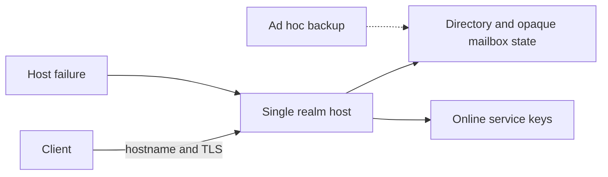
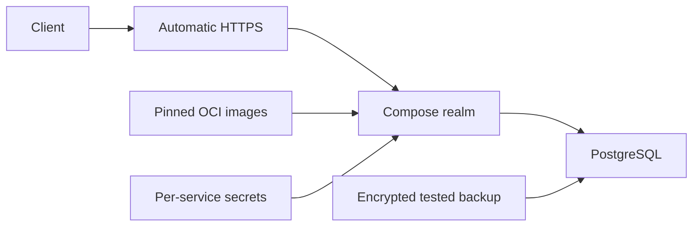
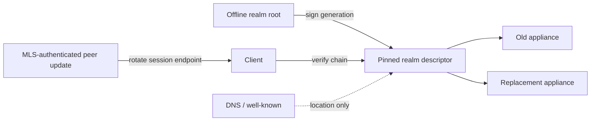
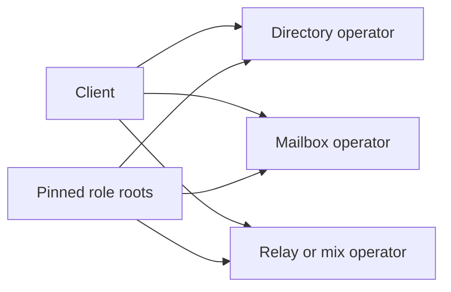

# Security Hardening Proposal: Make a realm replaceable without making it trusted for content

## Decision

Decide how a person or small organization can deploy a Session Chat realm with
low operational friction, replace a failed host, and preserve explicit trust
continuity without turning the realm into a plaintext, membership, or universal
key authority.

## Executive Recommendation

There are three viable shapes. **Option 1, Hostname-preserving Compose
appliance**, is the smallest deployment baseline. **Option 2, Signed portable
realm appliance**, adds a client-pinned realm descriptor, offline root, service
key separation, and explicit migration generations; I recommend it as the
target of the hosting spike. **Option 3, Split-operator realm**, deploys
directory, mailbox, and transport across independent operators and should remain
an advanced profile after the single-node path is measurable.

The appliance is replaceable because its images and configuration are portable
and its authority is represented by signed protocol objects, not because every
byte is recoverable. A sudden loss may discard opaque mail and cause downtime.
Client-held MLS state and peer-authorized transport rotation are what prevent a
realm failure from becoming a content-key recovery event.

## Evidence

I inspected the current realm, transport, mailbox-authority, rollback, and
deployment contracts and compared them with current Compose, OCI, TLS, discovery,
and PostgreSQL documentation. The structural diagnosis comes mostly from the
project’s own layer separation: host replacement must preserve service
continuity without granting a realm root the right to add MLS members or decrypt
messages.

| Evidence | Finding or document | What it establishes |
| --- | --- | --- |
| `H001` | [Realm administration and infrastructure boundaries](../../../ARCHITECTURE_V2.md) | Realms configure services and may observe operational metadata, but should not possess message keys or plaintext. |
| `H002` | [Transport contracts](../../../TRANSPORTS.md) | Delivery moves opaque envelopes, rights are separate, and Private mode cannot silently downgrade. |
| `H003` | [Right-specific capability decision](../../../adr/0010-use-right-specific-mailbox-capabilities.md) | Deposit, receive, acknowledgement, and rotation authority cannot be collapsed into an ambient host credential. |
| `H004` | [Phase 3 deployment gates](../../../ROADMAP_V2.md) | Compose packaging must also prove durable CAS, rollback rejection, crash recovery, concurrency, and bounded abuse. |
| `H005` | [Docker Compose production guidance](https://docs.docker.com/compose/how-tos/production/) | A single-server Compose deployment is an officially supported simple production shape, with production overrides and restart policy. |
| `H006` | [Compose secrets](https://docs.docker.com/compose/how-tos/use-secrets/) | Per-service file mounts narrow secret exposure compared with ambient environment variables, but remain host-managed files. |
| `H007` | [OCI image specification](https://github.com/opencontainers/image-spec/blob/main/spec.md) | Content-addressed, interoperable images support portable packaging and digest pinning across runtimes. |
| `H008` | [Caddy automatic HTTPS](https://caddyserver.com/docs/automatic-https) | A domain with reachable ports can automate certificate issuance, renewal, and HTTPS redirection. |
| `H009` | [RFC 8615 well-known URIs](https://www.rfc-editor.org/info/rfc8615) | A stable HTTPS location can publish realm metadata, but origin control means discovery is not an independent trust anchor. |
| `H010` | [PostgreSQL backup and restore](https://www.postgresql.org/docs/current/backup.html) | Portable and continuous backup mechanisms exist, but operators must choose and test recovery assumptions. |

`H001` through `H010` are observed. From them I infer that hostname-only trust
would make DNS, TLS account access, and backup custody the de facto realm
identity. A signed, versioned descriptor separates “where this realm currently
runs” from “which realm the client pinned,” while MLS-authenticated peers retain
authority over their actual session destinations.

## Current Design And Failure Mode

The roadmap names a Docker Compose realm but no deployable services exist. The
first-contact spike already separates a directory from a sealed mailbox and
requires monotonic receive-bundle generations, yet realm discovery, root-key
custody, service-key rotation, host migration, and restore semantics remain
open.

A naive deployment can be easy on day one but brittle on day two: the hostname,
TLS certificate, container tag, online signing key, database volume, and every
service role may live on one machine. If it dies, operators either restore an
untested image of all state or create a new host that clients cannot distinguish
from an attacker. If the same online root signs routine responses, compromise
also gains long-lived realm continuity authority.

The opposite failure is overengineering a federated or Kubernetes deployment
before one bounded service exists. That would increase the trusted operational
surface without proving the protocol boundaries.

## Desired Invariants

1. A realm host, its database, proxy, backups, and administrators never receive
   MLS group secrets, device roots, message plaintext, raw provider tokens, or a
   canonical plaintext participant list.
2. A client pins a stable realm identity and accepts endpoint or service-key
   changes only in a versioned descriptor with a strictly increasing generation
   and a valid continuity signature.
3. DNS, Web PKI, and `/.well-known/` locate a realm but do not silently replace
   the client’s pinned realm identity.
4. The offline realm root signs configuration generations and delegated service
   keys, not routine mailbox traffic. Online services hold only their role keys.
5. Realm authority cannot add an MLS member, approve admission on behalf of an
   inviter, or rotate a participant’s receive/acknowledgement capability.
6. Active session endpoint changes are authenticated by the relevant MLS member
   or session state, not inferred from a realm redirect.
7. A replacement can start from pinned OCI images and declarative configuration
   without source builds or a specific cloud provider.
8. Restore either preserves monotonic generations, idempotency, and capability
   boundaries or fails closed as a new realm. Stale snapshots are never silently
   accepted as continuity.
9. Backups contain only server-side configuration, public data, operational
   metadata, and opaque encrypted objects; losing a backup cannot reveal client
   plaintext or group keys.
10. Host loss is described honestly: undelivered opaque envelopes may be lost,
    expired invitations may need reissue, and availability is not guaranteed.
11. Private profiles never migrate to ordinary HTTPS or a fast relay without a
    new explicit profile decision.

## Constraints And Non-Goals

- No production realm service is currently implemented.
- Phase 1 remains in-memory, headless, and free of deployed dependencies.
- The first appliance targets one Linux host with Compose; Kubernetes, managed
  cloud databases, and federation are not baseline requirements.
- The design does not make a single operator anonymous, highly available, or
  resistant to traffic analysis.
- Realm migration is not client account recovery and does not move device or
  MLS keys to the host.
- The realm root is not a global Session Chat certificate authority.
- A replacement cannot recover opaque envelopes or capability state that was
  neither restored nor republished by clients.

## Before Architecture

[Diagram source](../diagrams/portable-realm-hosting-before.mmd)

This is a risk model for an unspecified future implementation, not a claim about
running code. It makes the likely concentration visible so the first deployment
can avoid relying on accidental host identity.

## Options

### Option 1: Hostname-preserving Compose appliance

Package all Phase 3 services as digest-pinned OCI images in one versioned
Compose profile. Put an automatic-HTTPS proxy in front, a supported PostgreSQL
release behind it, role-specific secrets in explicit file mounts, read-only
application filesystems where possible, resource limits, health checks, and
restart policies. Provide backup, restore, upgrade, and smoke-test commands.

This is the strongest simple option if the operator retains the hostname, DNS
account, realm/service secrets, and a fresh backup. It is easy to understand and
portable between ordinary Linux machines. It does not solve hostile DNS/TLS
replacement, offline root custody, or migration to a new realm identity, and a
single host remains one availability and metadata-observation domain.

[After-diagram source](../diagrams/portable-realm-hosting-compose-after.mmd)

| Change | Before | After | Security consequence | Cost |
| --- | --- | --- | --- | --- |
| Packaging | Unspecified | Pinned OCI images and Compose | Rebuild does not require source or one cloud | Image publication and update pipeline |
| TLS | Manual | Automatic issuance and renewal | Removes a common expiry/misconfiguration path | DNS and ACME availability remain dependencies |
| Secrets | Ambient or unspecified | Explicit per-service files | Narrows accidental cross-service access | Host administrator still controls files |
| Recovery | Ad hoc volume | Versioned backup/restore runbook | Makes host replacement testable | No identity continuity beyond retained hostname/keys |

Rollout begins only after Phase 3 services have bounded resource contracts.
Rollback is restoring the previously pinned image digests and compatible
database schema; destructive downgrade across an incompatible schema is not
allowed.

### Option 2: Signed portable realm appliance

Build on Option 1 and introduce a small canonical `RealmDescriptorV1`. It
contains a random realm identifier, protocol version, monotonic generation,
validity interval, enabled profiles and limits, role-specific endpoint and
verification keys, prior-descriptor digest, and offline-root signature. Clients
pin the realm identifier and root fingerprint on first explicit trust or through
an authenticated invitation. `/.well-known/session-chat` may publish the latest
descriptor, but clients validate the signature, pinned realm, time, generation,
and chain before use.

The offline root delegates bounded online service keys. Routine directory and
mailbox responses use those role keys, so compromise does not automatically
grant future migration authority. A planned replacement brings up a new
appliance, restores compatible server state, issues a higher-generation
descriptor with overlapping old/new endpoints, and drains old opaque work for a
bounded interval. A sudden replacement uses the latest offline-root recovery
bundle and database backup. Without the root, the operator has created a new
realm and clients require an explicit trust reset.

Realm continuity still does not authorize peer destinations. Existing members
rotate their deposit endpoints through an MLS-authenticated application message
or equivalent session state transition. Outstanding invitation descriptors that
cannot be reached or safely migrated expire and are reissued. This preserves the
right-specific capability boundary and prevents an operator redirect from
becoming mailbox authority.

[After-diagram source](../diagrams/portable-realm-hosting-signed-descriptor-after.mmd)

| Change | Before | After | Security consequence | Cost |
| --- | --- | --- | --- | --- |
| Realm identity | Hostname/TLS | Pinned offline-root identity | DNS or certificate-account takeover cannot silently become the same realm | Bootstrap and key-custody UX |
| Endpoint change | Redirect or config edit | Signed monotonic descriptor | Replacement is explicit and rollback-detectable for clients with state | Canonical schema, cache, and rotation logic |
| Service keys | Potential shared online key | Role-specific delegated keys | Limits compromise scope and future authority | Key issuance and revocation operations |
| Session migration | Realm redirect | MLS/member-authenticated endpoint rotation | Operator cannot grant receive or rotation authority | Client protocol and offline-peer coordination |
| Disaster recovery | Restore everything or restart | Classified restore, republish, or explicit new realm | Avoids false seamless-recovery claims | Some mail/invitations intentionally lost |

This option can be introduced before federation because its descriptor represents
one realm, not a global network. Rollback is a higher-generation descriptor that
returns to prior compatible endpoints; descriptor generation itself never
decreases.

### Option 3: Split-operator realm

Deploy the address directory, sealed invitation mailbox, rendezvous/mailbox, and
transport roles under independent administrative or network failure domains.
Clients verify each role’s delegated key and use privacy-partitioned lookup or a
mixnet where the selected profile requires it. This is the strongest option for
reducing one operator’s metadata view and correlated service compromise.

Its strongest case is a community ecosystem with enough independent operators
and traffic to make separation real. On one organization’s three virtual
machines it may add complexity without meaningful non-collusion. It also creates
cross-operator incident, version, clock, and abuse-policy coordination that the
single-node service contracts have not yet earned.

[After-diagram source](../diagrams/portable-realm-hosting-split-after.mmd)

| Change | Before | After | Security consequence | Cost |
| --- | --- | --- | --- | --- |
| Metadata | One operator can correlate roles | Views partitioned by role | Reduces correlation under non-collusion | More operators, latency, and incident coordination |
| Availability | One failure domain | Independent role failures | Some failures can be isolated | Complete workflow has more dependencies |
| Deployment | One Compose profile | Multiple profiles/domains | Supports stronger privacy profiles | Harder “anyone can run it” story |
| Trust | One realm root can delegate all roles | Optional independent role roots | Narrows root compromise | Bootstrap and rotation complexity |

Rollout should reuse the same container images and APIs as Option 2, changing
only endpoint/operator placement. Rollback to a co-located deployment is a new
explicit privacy-profile decision, never an automatic failover for Private mode.

## Comparison

| Dimension | Option 1: Compose | Option 2: Signed portable | Option 3: Split operator |
| --- | --- | --- | --- |
| Security | Good packaging hygiene; hostname and host keys remain concentrated | Adds explicit identity continuity, role keys, and client-controlled session migration | Best potential metadata and compromise partitioning under real non-collusion |
| Performance | Fewest network hops | One small descriptor verification/cache; ordinary data path unchanged | More network paths and potentially privacy-transport latency |
| Memory | One proxy, services, and database on one host | Same plus small descriptor/key history | Repeated service overhead across hosts |
| Reliability | Simple but one failure domain | Planned overlap and explicit disaster modes improve recovery; stale state still fails closed | Role isolation helps some failures but more dependencies can block workflows |
| Operability | Lowest baseline; backup and upgrades still required | Adds offline-root custody, generation, drain, and restore drills | Highest monitoring, coordination, and certificate burden |
| Migration | Requires retained hostname and keys | Supports signed endpoint changes and explicit new-realm fallback | Reuses Option 2 protocol but changes topology and policy |

These are source-derived mechanisms, not measured availability or resource
results. The deployment experiment must publish CPU, memory, disk, restore time,
and failure behavior before any “easy” or “highly available” claim.

## Recommendation

I recommend Option 2 as the design target, implemented in two increments: first
make Option 1 genuinely one-command and restore-tested, then add the signed realm
descriptor before clients rely on a hosted realm. This keeps the initial operator
experience approachable while preventing the hostname from becoming an
accidental permanent trust root.

Option 1 alone should win for a local-only laboratory where clients are reset
with the host and no continuity claim is made. Option 3 should win only when
independent operators, traffic, and a named metadata adversary justify its cost.

## Evidence Coverage And Residual Risk

| Evidence | Option 1 | Option 2 | Option 3 | Residual risk |
| --- | --- | --- | --- | --- |
| `H001` — realm boundary | Mitigates through opaque services | Addresses with explicit root/service roles | Further partitions operators | Host still controls availability and sees role metadata |
| `H002`–`H003` — transport rights | Preserves if services implement typed caps | Addresses migration without realm super-capability | Preserves across operators | Stolen client capabilities remain bearer authority |
| `H004` — Phase 3 durability gates | Requires them | Requires them plus descriptor monotonicity | Requires them independently per role | No service implementation or crash evidence exists yet |
| `H005`–`H008` — portable packaging/TLS | Addresses baseline | Inherits | Inherits per operator | Supply-chain compromise or malicious images can violate all guarantees |
| `H009` — discovery | Uses origin as location | Separates location from pinned identity | Separates per role | First-use trust and invitation bootstrap remain human/policy decisions |
| `H010` — backup/restore | Mitigates host loss | Adds classified continuity behavior | Adds per-role restores | Backups preserve metadata and opaque ciphertext beyond live TTL unless pruned |

## Migration And Rollout

Start with a `local` Compose profile using test keys and deterministic smoke data.
Add a production-shaped single-host profile only after resource bounds and
secret-redaction tests exist. Publish multi-architecture OCI images by immutable
digest and keep source-build instructions as a reproducibility path, not the
normal install path.

The bootstrap tool generates role secrets and an offline realm root locally,
writes only service-specific online material into Compose secret files, prints a
realm fingerprint for out-of-band verification, and creates an encrypted root
recovery package outside the live host. It must never send secrets to a project
service. Secret files are not committed, included in images, or passed as normal
environment variables.

For planned migration, verify backup freshness, start the replacement, restore,
run conformance checks, sign a higher-generation overlap descriptor, observe
drain metrics, then retire the old service. For unplanned loss, either restore
with the retained root and accept bounded opaque-message loss or declare a new
realm and require explicit client trust. A database snapshot whose monotonic
state is behind the descriptor or client cache fails closed.

## Validation Plan

- On a clean supported Linux VM with only Docker/Compose installed, measure the
  time and operator actions from configuration to healthy HTTPS service. Record
  every prerequisite; “one command” begins after DNS and firewall setup.
- Verify images are referenced by digest, run as non-root where practical, use
  read-only filesystems and explicit writable volumes, have health checks and
  resource limits, and receive only their role-specific secrets.
- Capture traffic and inspect database, volumes, backups, logs, metrics, crash
  output, and proxy access logs using plaintext and secret canaries. Any client
  group key or plaintext is a stop condition.
- Flood every unauthenticated endpoint at maximum valid size and malformed size;
  verify bounded CPU, memory, storage, retries, and stable rejection behavior.
- Crash before and after directory generation CAS, mailbox acknowledgement,
  idempotency recording, and outbox writes. Competing service instances must not
  accept two successor generations.
- Perform monthly-style restore drills onto a different Linux distribution or
  OCI runtime host. Measure recovery time and point objective, retained data,
  expired-data pruning, and stale-snapshot behavior.
- Test planned migration with old/new overlap, clients offline for the entire
  overlap, a malicious lower-generation descriptor, DNS takeover, TLS
  reissuance, missing old root, and compromised online service keys.
- Assert that realm-signed endpoint changes do not provide receive,
  acknowledgement, rotation, admission, or MLS membership authority.
- Run Private-mode network-deny tests during host failure; no direct or fast
  endpoint may be contacted automatically.

## Implementation Work Packages

- Define the minimum service graph, data classification, and Compose threat
  model before writing deployment files.
- Implement service health/readiness and conformance endpoints with no secret
  or stable-participant output.
- Produce digest-pinned OCI images and a single-node Compose profile with Caddy,
  PostgreSQL, quotas, secrets, and production-safe defaults.
- Implement backup, restore, upgrade, rollback, and clean-host smoke scripts.
- Specify canonical `RealmDescriptorV1`, offline-root delegation, generation,
  expiry, prior-digest chaining, and client cache rules; record it in an ADR.
- Implement planned and disaster migration simulators before exposing network
  services to users.
- Add MLS-authenticated participant endpoint rotation without granting the realm
  a right-specific capability it does not own.
- Add the optional split-operator profile only after the observer matrix and
  non-collusion claims are testable.

## Open Questions

- Is the realm root created per deployment, per organization, or per named
  privacy domain, and how is first-use trust presented without implying global
  identity?
- Which service state is mandatory to restore, safe to discard, or forbidden to
  back up? The answer differs for monotonic directory state, opaque mail, dedupe
  state, and online keys.
- How long may planned old/new endpoints overlap without creating avoidable
  correlation or extending stolen-capability life?
- Should a realm descriptor chain survive an offline-root rotation through
  cross-signatures, threshold recovery, or an explicit client trust reset?
- Which PostgreSQL major version and backup mechanism fit the actual write rate
  and recovery objectives once measured?
- Can an appliance remain useful behind NAT without a public domain, and what
  weaker trust/discovery label should that local-only mode carry?
- What minimum independent-operator and traffic conditions justify advertising
  the split profile as a metadata improvement?
